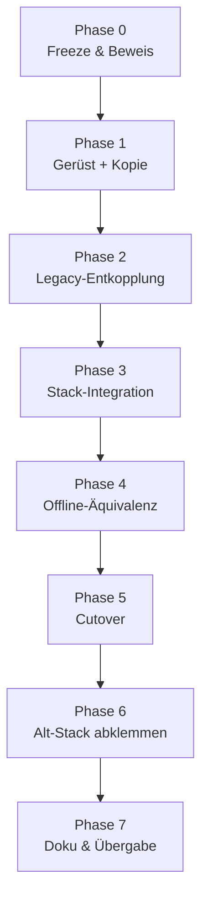

# Migrationsplan — `features-service` von `/openbrain/` nach QJM

**Erstellt:** 21.09.2026
**Auftrag:** Code des Feature-Service ins QJM-Projekt überführen — **ohne** Legacy-Ballast
(insbesondere ohne Bezüge auf das `/openbrain/`-Projekt).
**Status:** Plan. Es wurde **nichts** verschoben, geschrieben oder gestoppt.

---

## 0. Kurzfassung

Der Feature-Service ist **kein QJM-Bestandteil, sondern eine externe Abhängigkeit**:
Er liegt unter `/home/daniel/openBrain/features-service`, läuft im Compose-Projekt
**`openbrain`** und wird von QJM nur per HTTP aufgerufen.

Die Migration ist deshalb **kein Copy-Paste, sondern eine Entkopplung**: Der Server-Teil,
der `openbrain`-Infrastruktur voraussetzt (MQTT/`nexus-broker`, `postgrest:3000`,
`nexus-service:7734`, Compose-Projekt `openbrain`), wird **ersetzt statt mitgenommen**.
QJM braucht davon nichts — es gibt in QJM genau **einen** echten Konsumenten
(`mcp-pca`), und der spricht drei reine HTTP-Endpunkte.

Gleichzeitig ist die Migration **verlustfrei möglich**, weil der eigentliche Wert —
die 21 Feature-Spalten in `1D_features.parquet` — über einen **Datenvertrag** wirkt,
nicht über Code-Imports: QJM liest die Dateien an **12 Stellen** in `pca-service`,
aber importiert **kein einziges Python-Modul** aus dem Feature-Service.

**Kernentscheidung:** Der Feature-Service wird ein **Kompositions-Member des
`llm-gateway`-Stacks** (wie `pca-service` und `stock-data-node`) — nicht ein neuer,
eigener Stack.

---

## 1. Ist-Zustand (verifiziert am 21.09.2026)

### 1.1 Wo der Code liegt

| Aspekt | Wert |
|---|---|
| Quellbaum | `/home/daniel/openBrain/features-service/` (Git-fremd, keine Versionskontrolle im Repo) |
| Container | `openbrain-features-service`, healthy, 0 Restarts |
| Image | `openbrain-features-service:latest` (ID `e2958c77442a`, Stand 18.09. 22:59 UTC) |
| Compose-Projekt | **`openbrain`**, Config `/home/daniel/openBrain/docker-compose.yml`, Service `features-service` |
| Compose-Datei im Serviceordner | `features-service/docker-compose.yml` — **veraltet**: anderer Projekt-/Service-Name (`stock-data-features`), falsche Volume-Pfade. Wird **nicht** benutzt |
| Port | `8003` (Host-Netz) |
| Laufzeit | Python 3.11-slim, FastAPI/Uvicorn |

### 1.2 Kopplung an das `openbrain`-Projekt (das zu Entfernende)

| # | Kopplung | Fundstelle | Warum Legacy |
|---|---|---|---|
| L1 | **MQTT-Publish** an `nexus-broker:1883` | `src/mqtt_publisher.py`, Aufruf `processor.py:265` | QJM nutzt MQTT **nirgends**. `mcp/agent-pca/tools/shared.ts:32`: *„Legacy: was sending to nexus-service:7734. Now a no-op."* Ein No-op ohne Empfänger |
| L2 | **HTTP-Post** an `nexus-service:7734/api/send` | `src/scanners/manager.py:46` | Nexus existiert in QJM nicht |
| L3 | **`depends_on: nexus-broker`** | Compose-Projekt `openbrain` | Startabhängigkeit auf einen fremden Stack |
| L4 | **`POSTGREST_URL=http://postgrest:3000`** | `scheduler.py:53`, `main.py:426`, `scanners/manager.py:29` | QJM erreicht PostgREST unter `SUPABASE_URL=http://host.docker.internal:8001` |
| L5 | **Service-Role-Key als Compose-Env** | Container-Inspect | QJM bezieht ihn aus `llm-gateway/.env` |
| L6 | **Compose-Projekt `openbrain`, `network_mode: host`** | Container-Labels | QJM-Dienste laufen im `llm-gateway`-Netz mit `host.docker.internal` |
| L7 | **Alter MADBO-Scanner** (`scanners/`, `/scanners/run`) | `src/scanners/*`, `main.py:524-568` | **Fachlich dupliziert und überholt**: QJM hat `madbo` als Scanner im PCA-Scanner-Framework (`services/pca-service/scanners.py`), vom Agenten genutzt (`run_technical_scanner`) |
| L8 | **Korrelations-Clustering** (`cluster.py`, `/features/cluster`) | `src/cluster.py`, `main.py:418-522` | Schreibt `cluster_*`-Watchlists nach Supabase; in QJM nicht nachgefragt. QJM hat Overlay-/Preset-Mechanik für den Viewer |
| L9 | **On-the-fly-Endpunkte** `/features/rs` (liest **alle** 41.500 Parquets pro Abfrage, O(N)) und `/features/ma` | `main.py:202-360` | QJM nutzt sie **nicht**: `calculate_indicator` (PCA/MCP) und `get_timeseries` bedienen das; `manage_feature_calculation` ruft nur `status`/`calculate`/`schedule` |
| L10 | **Ungenutzte Imports/Dateien** | `main.py:12` `re`, `:18` `numpy`; `src/test_ffill.py` | Abfall |
| L11 | **Drei RS-Implementierungen** | `calculator.py:140`, `calculator.py:344`, `processor.py:127-145` | Zwei davon sind tot oder redundant (Befund `HANDOVER.md` §4.3) |
| L12 | **Zwei Minervini-Implementierungen** (Parquet 0–8 vs. Scanner 0–6) | `calculator.py:245-341` vs. `services/pca-service/scanners.py` | Divergenzrisiko; QJM-Variante bleibt |

> **Befund:** Der Legacy-Anteil ist **nicht** der Compute-Kern, sondern die
> **Infrastruktur-Anbindung** plus **drei fachlich überholte Endpunkt-Familien**.

### 1.3 Was QJM am Service tatsächlich nutzt (der echte Vertrag)

**Genau ein Konsument:** `mcp/agent-pca/tools/features.ts` — drei Endpunkte:

| Endpunkt | QJM-Aufrufer | Zweck |
|---|---|---|
| `GET /features/status` | `manage_feature_calculation: GET_STATUS` | Live-Fortschritt, `last_run`, `schedule` |
| `POST /features/calculate[?priority=&stream=]` | `…: TRIGGER` | Batch-Lauf starten; `stream=true` → Telemetrie |
| `GET|POST /features/schedule` | `…: GET_SCHEDULE` / `SET_SCHEDULE` | 60-Minuten-Takt, persistiert |

**Zweiter Konsument (Trigger, nicht Leser):** `stock-data-node`
(`/home/daniel/stock-data-node/src/main.py:146-176`) ruft nach Downloads
`POST /features/calculate` — URL über `FEATURE_SERVICE_URL`, Default
`http://localhost:8003/features/calculate`.

**Der eigentliche Wert ist ein Datenvertrag.** Geschrieben wird pro Ticker
`<parquet>/<TICKER>/1D_features.parquet` (plus `$STATS.MARKET_BREADTH/1D.parquet`),
gelesen von QJM an 12 Stellen in `pca-service`:

`indicators.py:38` · `chart_data.py:148,155` · `scanners.py:746` ·
`universal_scanner.py:214,363` · `benchmark_scanner.py:25,47,67,95`

### 1.4 Feature-Kontrakt (21 Spalten, live verifiziert)

Der Service ist die **Quelle** dieser über `get_timeseries` sichtbaren Spalten:

`ma_sma_10/20/50/100/150/200` · `bb_20_upper/lower/avg/bandwidth` ·
`stock_10_1_k/_d` · `ibd_rs` · `minervini_score` · `minervini_trend_template` ·
`breadth_minervini` · `breadth_minervini_pct` · `daily_range` · `dollar_volume` ·
`ma_sma_50_dollar_volume` · `adr_20`

> **Konsequenz:** Diese 21 Spalten sind der **Abnahmemaßstab** der Migration.
> Weichen sie ab, ist die Migration fachlich gescheitert — unabhängig davon,
> ob der Container startet.

### 1.5 Warum die Migration nicht trivial ist: derselbe Pfad, der geschrieben wird

| Dienst | Mount heute | Zugriff |
|---|---|---|
| `features-service` (openbrain) | `/home/daniel/stock-data-node/data:/app/data` | **rw** |
| `pca-service` (QJM) | `/home/daniel/stock-data-node/data/parquet:/parquet` | ro |
| `mcp-pca` (QJM) | `/home/daniel/stock-data-node/data/parquet:/parquet` | ro |

Der Service schreibt **in denselben Baum**, aus dem QJM liest. Das ist heute die
bewährte Kopplung — und der einzige Grund, warum es für die Dateiablage
**keine** Migrationsnotwendigkeit gibt.

### 1.6 Laufzeit-Ist (live, 21.09.2026)

| Kennzahl | Wert |
|---|---|
| Letzter Lauf | 21.09.2026 18:17:16, ✅ SUCCESS |
| Dauer | **1 m 46 s** (nach den Patches 01–05; vorher 9 m 17 s) |
| Ticker | 41.526 (41.526 OK / 0 Fehler) |
| Datenpunkte | 29.753.703 |
| Durchsatz | 1,2 ms/Ticker (gemeldet) |
| Schedule | `INTERVAL`, **60 min**, aktiviert, nächster Lauf 19:15:29 |

> **Wichtig:** Der Lauf ist weiterhin ein **voller** Lauf über alle Ticker —
> es gibt **keinen** Inkremental-/Dirty-Window-Mechanismus im Code (`processor.py`
> hat keine Skip-Logik). Die Beschleunigung kam aus Parallelisierung
> (`ProcessPoolExecutor`), Dedup und `fast_rank`, nicht aus Überspringen.

### 1.7 Reifegrad / Risiken des Ist-Zustands

- **Ein Baum, zwei Versionen:** `container_src/` und `patches/_patched/` im
  Playground sind **Kopien** für die Benchmark-Analyse, nicht die Produktion.
  Der **laufende Container** ist die Wahrheit (DEPLOY.md: Host-Baum trug den Patch
  zunächst nicht — per Docker-Daemon ausgerollt).
- **Kein Rollback-Punkt in einem Repo:** Ältere Image-ID `67c9633b2ccd` (15.09.)
  liegt noch im Image-Store; Backups unter
  `dsh_playground/rs_benchmark/backup_features_service_20260918-235022/`.
- **Sandbox-Asymmetrie:** Änderungen außerhalb `/home/daniel/QJM` sind aus der
  Agenten-Session nicht schreibbar. **Genau das ist ein Hauptmotiv dieser Migration.**

---

## 2. Zielbild

```
/home/daniel/QJM/
├── llm-gateway/docker-compose.yml      # + Service "feature-service"
└── services/
    ├── pca-service/                    # Konsument (unverändert, 12 Lesestellen)
    └── feature-service/                # NEU — aus openBrain überführt, entkoppelt
        ├── Dockerfile
        ├── requirements.txt
        ├── README.md
        ├── config/
        │   ├── features.json           # Feature-Definitionen (versioniert!)
        │   └── settings.json           # processing_threads
        ├── src/
        │   ├── main.py                 # FastAPI: status | calculate | schedule | health
        │   ├── config_parser.py
        │   ├── calculator.py           # Compute-Kern (IBD-RS, Minervini, MA, BB, Stoch)
        │   ├── processor.py            # Pass 0a/0b/1
        │   ├── fast_rank.py
        │   ├── parquet_io.py
        │   ├── market_breadth.py       # $STATS.MARKET_BREADTH
        │   ├── job_manager.py
        │   ├── scheduler.py
        │   ├── logging_setup.py
        │   └── schemas.py
        └── tests/                      # Portierung der bestehenden Unit-Tests
```

**Bewusst NICHT im Zielbild:** `scanners/`, `cluster.py`, `mqtt_publisher.py`,
`/features/rs`, `/features/ma`, `/scanners/run`, `/features/cluster`,
`repro_issue.py`, `run_features_scratch.py`, `test_logging_repro.py`, `src/test_ffill.py`.

---

## 3. Entscheidungen, die den Plan tragen

### E1 — Ort: `services/feature-service/` im `llm-gateway`-Stack

**Entscheidung:** Eigener Service unter `services/`, eingetragen als Member der
**vorhandenen** `llm-gateway/docker-compose.yml`.

**Begründung:** Spiegelt `pca-service` exakt (Daten-Dienst im QJM-Repo, gleicher
Stack, gleiche Env-Konventionen). Ein separater Compose-Stack würde eine zweite
PostgREST-Konfiguration und einen zweiten Env-Ort schaffen — genau die Duplikation,
die hier beseitigt werden soll.

**Verworfen:** (a) Eingliederung in `pca-service` — der Feature-Lauf ist ein
CPU-Batch über 41.500 Ticker und würde den interaktiven Chart-Dienst blockieren;
andere Lebenszyklen, andere Abhängigkeiten (sklearn, Prozess-Pools).
(b) Neuer eigener Stack — zusätzliche Infrastruktur ohne Nutzen.

### E2 — Netzwerk: Bridge + `host.docker.internal`, **nicht** `network_mode: host`

**Entscheidung:** Bridge-Netz des `llm-gateway`-Stacks, Port `8003:8003` publiziert,
PostgREST über `SUPABASE_URL=http://host.docker.internal:8001`.

**Begründung:** Konsistent mit allen QJM-Diensten; entfernt L3/L6 vollständig.
`stock-data-node` erreicht den Dienst weiterhin, weil es selbst im Host-Netz läuft
und `localhost:8003` das publizierte Port-Mapping trifft.

### E3 — Datenablage bleibt, wo sie ist

**Entscheidung:** `1D_features.parquet` bleibt bei den Tickern unter
`/home/daniel/stock-data-node/data/parquet` (rw gemountet).

**Begründung:** 12 Lesestellen in `pca-service` und das MCP-Tooling hängen an diesem
Pfad; ein Umzug wäre eine Datenmigration über 41.500 Verzeichnisse **ohne fachlichen
Gewinn**, weil der Pfad bereits ein dienstübergreifender Vertrag ist und beide Dienste
denselben Host teilen. Ein Pfadwechsel wird als **optionale Folgeaufgabe** geführt
(§6), nicht als Teil dieser Migration.

### E4 — MQTT entfällt ersatzlos

**Entscheidung:** `mqtt_publisher.py` wird **nicht** portiert; der Aufruf in
`processor.py:265` entfällt.

**Begründung:** Nachweislich ohne Empfänger (QJM: kein `paho`-Import, kein
`nexus`-Client; `shared.ts` nennt den Vorgängerpfad ausdrücklich „now a no-op").
Der Priority-Trigger bleibt über `POST /features/calculate?priority=` erhalten —
also genau der Pfad, den QJM wirklich nutzt.

### E5 — Kein Import, kein `sys.path`-Trick, keine Cross-Repo-Pfade

**Entscheidung:** Keine Datei im Zielbaum darf `/home/daniel/openBrain`,
`nexus`, `postgrest:3000` oder `mqtt` enthalten.

**Begründung:** Das ist der Kern des Auftrags („keinen Legacy-Code mitschleppen")
und zugleich maschinell prüfbar (Abnahmekriterium A7).

### E6 — Cutover statt Parallelbetrieb auf Port 8003

**Entscheidung:** Der Alt-Container wird **im selben Fenster gestoppt**, in dem der
neue startet. Kein Parallelbetrieb beider Writer auf demselben Parquet-Baum.

**Begründung:** Zwei Schreiber auf dieselben `1D_features.parquet` (jeweils
`pq.write_table` + `os.replace`) würden sich gegenseitig überschreiben und das
Lesen von QJM inkonsistent machen. Die Datenmenge ist mit 1 m 46 s Laufzeit klein
genug, um das Fenster kurz zu halten.

### E7 — Konsumenten-Vertrag bleibt API-identisch

**Entscheidung:** Pfade, Query-Parameter, Response-Feldnamen und Port bleiben
**unverändert**. Geändert wird nur, *wer* den Dienst hostet.

**Begründung:** Dann ist der Cutover ein Umzug, und die 12 Lesestellen in
`pca-service` bleiben unangetastet. Der einzige anzupassende Aufrufer ist
`mcp-pca` mit einer URL.

---

## 4. Was exakt mitgenommen wird

| Datei | Ziel | Änderung |
|---|---|---|
| `src/calculator.py` | `services/feature-service/src/` | Nur die toten RS-Dubletten entfernen (L11); Rechenpfade **bit-identisch** |
| `src/processor.py` | dito | `mqtt_publisher`-Import und -Aufruf entfernen; `getpass`-Pfad unverändert |
| `src/fast_rank.py` | dito | unverändert |
| `src/parquet_io.py` | dito | unverändert (atomares Schreiben bleibt) |
| `src/market_breadth.py` | dito | Docstring-Referenz auf `openBrain` entfernen |
| `src/job_manager.py` | dito | unverändert (inkl. korrigierter ETA aus Patch) |
| `src/scheduler.py` | dito | `POSTGREST_URL` → `SUPABASE_URL` (QJM-Konvention), sonst unverändert |
| `src/config_parser.py` | dito | unverändert |
| `src/logging_setup.py` | dito | unverändert |
| `src/schemas.py` | dito | Nur behalten, was die verbleibenden Endpunkte brauchen |
| `src/main.py` | dito | Endpunkte `/features/status`, `/features/calculate`, `/features/schedule`, `/health`; Rest entfällt |
| `config/features.json` | `services/feature-service/config/` | **unverändert** (Fachparameter!) |
| `config/settings.json` | dito | unverändert |
| `tests/unit/*` | `services/feature-service/tests/` | Importpfade `src.` → angepasst |
| `Dockerfile` | `services/feature-service/` | an `pca-service/Dockerfile` angelehnt (python:3.12-slim) |
| `requirements.txt` | dito | um `sklearn`/`paho-mqtt` bereinigt |

**Nicht mitgenommen** (siehe L1–L12): `mqtt_publisher.py`, `scanners/`-Baum,
`cluster.py`, `test_ffill.py`, `repro_issue.py`, `run_features_scratch.py`,
`test_logging_repro.py`, `logs/`, `data/`, `static/`, `docker-compose.yml` (alt).

---

## 5. Abhängigkeiten und Reihenfolge



**Kritischer Pfad:** Phase 0 → Phase 1 → Phase 4 → Phase 5. Phasen 2 und 3 können
innerhalb Phase 1/3 verschoben werden, solange Phase 4 vor Phase 5 bleibt.

**Harte Vorbedingungen für Phase 5 (Cutover):**
1. Phase 4 hat ein **bit-identisches** Ergebnis auf einer Datenkopie gezeigt.
2. Der gebackene **Zeitplan steht auf „disabled"** oder ist bewusst übernommen.
3. `stock-data-node`-Trigger-Ziel ist bekannt und getestet (nicht geraten).
4. Rollback-Weg ist vorbereitet (Alt-Image `e2958c77442a` bleibt getaggt).

---

## 6. Nicht Teil dieses Auftrags (bewusst ausgeklammert)

| Thema | Warum nicht jetzt |
|---|---|
| **Inkrementalmodus** (nur letzten ~260 Bars lesen) | Größter Laufzeit-Hebel laut `HANDOVER.md` §11, aber es ändert Rechen-Semantik und braucht eigenen Äquivalenztest. **Nach** dem Umzug, nicht während |
| **RS-Gates verschärfen** (`min_dollar_volume_50`, Bars-Gate, Inflator) | Ändert die **gesamte** `ibd_rs`-Historie → macht jeden Backtest ungültig. Eigene Entscheidung mit Backup |
| **Umzug der Feature-Dateien** in einen QJM-eigenen Pfad | 12 Lesestellen + Datenkopie über 41.500 Verzeichnisse; reine Kosmetik |
| **Zusammenführen der Minervini-Implementierungen** | Fachliche Entscheidung (8 Bedingungen vs. 6), betrifft Scanner-Ergebnisse |
| **Abschaffung der `sticky` 60-Minuten-Volläufe** zugunsten Event-Trigger | Verhaltensänderung; braucht Lastbetrachtung |
| **Deprecation von `minervini_trend_template`** | Eigene Entscheidung (s. u., Treffer 2) |

---

## 7. Offene Punkte, die vor Phase 1 zu beantworten sind

### O1 — Verbindliche Quellversion des Codes

Der **laufende Container** trägt Patches, die im Host-Baum zeitweise fehlten.
Vorschlag: **Container-Artefakt als Quelle**, Host-Baum als Gegenprobe; Abweichung
wird dokumentiert, nicht „weggeglättet".

### O2 — Ist `minervini_trend_template` noch gewollt?

`config/features.json:144-153` deklariert die Spalte **ohne `type`**, während
`calculator.py:280,353` sie schreibt. Sie ist **nicht** in den 21 von PCA
gemeldeten Features enthalten. Entweder bewusst tot oder ein stiller Ausfall —
das gehört entschieden, **bevor** der Config nach QJM wandert.

### O3 — Bleibt der Schedule-Träger in `system_settings`?

Der Service persistiert `features_schedule_config` in Supabase. Das ist
konfigurations-, nicht codebezogen. Vorschlag: **bleibt**, weil
`manage_feature_calculation: GET_STATUS` das Feld `schedule` aus dieser Zeile
rendert und QJM den Takt dort umstellt.

### O4 — Version der Numerik-Bibliotheken

Ist-Stand Feature-Service: `pandas 3.0.1`, `numpy 2.4.3`, `pyarrow 23.0.1`.
`pca-service`: `pandas 2.2.3`, `numpy 2.2.1`, `pyarrow 18.1.0`. Getrennte Container
→ kein technisches Problem. Vorschlag: **Versionen des Feature-Service unverändert
lassen** (bit-identisches Ergebnis hat Vorrang vor Versionsharmonie), Angleichung
als separate Aufgabe.

---

## 8. Risiken

| # | Risiko | Auswirkung | Gegenmaßnahme |
|---|---|---|---|
| R1 | Feature-Werte driften nach dem Umzug | Stille Falschbewertung von ~20.000 Tickern, unentdeckt | Phase 4 als **Blocker**; Stichprobenvergleich über `get_timeseries` |
| R2 | Zwei Writer auf demselben Parquet-Baum | Beschädigte/wechselseitig überschriebene `1D_features.parquet` | Cutover in einem Fenster, Alt-Container stoppen (E6) |
| R3 | Sandbox-Restriktion beim Kopieren aus `/home/daniel/openBrain` | Kopie schlägt fehl oder ist unvollständig | Quelle über Container-Artefakt (`docker cp`), Ziel liegt in QJM → schreibbar |
| R4 | Alte Compose-Datei wird „wiederentdeckt" | Build aus veraltetem Serviceordner, falsche Volumes | Datei nicht portieren; im Migrations-README als verworfen vermerken |
| R5 | Port 8003 doppelt belegt beim Cutover | Neuer Container startet nicht | Alt-Container zuerst stoppen; Port-Check als Schritt |
| R6 | `stock-data-node`-Trigger zielt nach dem Umzug ins Leere | Features werden nach Downloads nicht neu gerechnet | Expliziter Funktionstest des Triggers in Phase 5 |
| R7 | Nur ein Proxy statt Rückwärtsrechnung | **Kein** echter Äquivalenzbeweis auf Zellebene | Stichprobe (z. B. 200 Ticker, alle 21 Spalten) als akzeptierter Kompromiss, im Abnahmeprotokoll benannt |

---

## 9. Definition of Done

- [ ] `services/feature-service/` existiert, versioniert, ohne einen einzigen
      Treffer für `openbrain|nexus|mqtt|postgrest:3000` (A7).
- [ ] Der Dienst läuft im `llm-gateway`-Stack als `feature-service` und ist healthy.
- [ ] `POST /features/calculate`, `GET /features/status`, `GET /features/schedule`
      antworten **formgleich** zum Alt-Dienst.
- [ ] Ein voller Lauf über alle Ticker endet mit 0 Fehlern.
- [ ] Die 21 Feature-Spalten sind stichprobenartig identisch (A3).
- [ ] `$STATS.MARKET_BREADTH` ist identisch (A4).
- [ ] Der `stock-data-node`-Trigger erreicht den neuen Dienst (A6).
- [ ] Der Alt-Container ist gestoppt und aus dem `openbrain`-Stack entfernt.
- [ ] Rollback ist dokumentiert und einmal geprobt worden.

---

## 10. Zeitschätzung

| Phase | Aufwand | Anmerkung |
|---|---|---|
| 0 Freeze & Beweis | ~30 min | Container-Artefakt ziehen, Hashes bilden |
| 1 Gerüst + Kopie | ~1 h | Mechanisch |
| 2 Legacy-Entkopplung | ~1,5 h | Selektives Entfernen; Verifikation |
| 3 Stack-Integration | ~1 h | Compose + Env; `docker compose config` |
| 4 Offline-Äquivalenz | ~2 h | **Der eigentliche Prüfstein** |
| 5 Cutover | ~30 min | Kurzes Fenster, Trigger-Test |
| 6 Alt-Stack abklemmen | ~20 min | Compose-Eintrag entfernen, Image behalten |
| 7 Doku & Übergabe | ~45 min | README, Rollback-Probe |

**Summe: ca. 1 Arbeitstag**, davon rund ein Drittel für die Äquivalenzprüfung.
